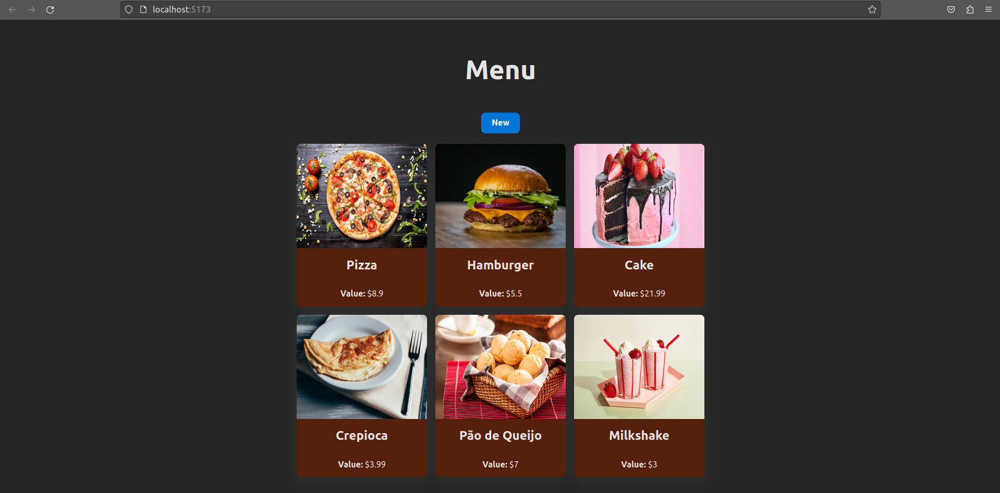
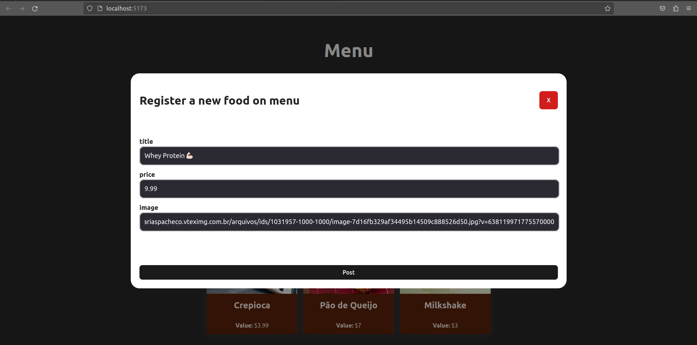

# Food Menu

This project is a fullstack application that simulates a **Restaurant Menu**, which you can add new foods to the Menu.

<h1 align="center">
    
    
</h1>

## Technologies that I used:

### Backend:

- Java Spring 🍃
- Spring MVC
- Spring Data JPA
- Lombok
- PostgreSQL

### Frontend:
- React.js
- TypeScript
- React Query
- Axios

# To run:
Clone the repo:
```bash
    git clone https://github.com/caiogmello/menu-application.git
```
Then run the React application:
```bash
    cd frontend/
    npm install
    npm run dev
```
Then, open http://localhost:5173/.

Now, acess the backend folder:
```bash
    cd ../backend/
```
- Inside your IDE, install all maven dependencies.
- Then, create your own database named 'food'.
```bash
    cd src/main/resources
    touch application.properties
```
- Now, inside the ```application.properties``` file, put this your database informations. Like this:
```yaml
    spring.datasource.url = jdbc:postgresql://localhost:5432/food
    spring.datasource.username = yourusername
    spring.datasource.password = yourpassword
```
Now, run the Spring using your IDE.


# Credits
This project was inspired on [Fernanda Kipper](https://github.com/Fernanda-Kipper)’s project, that you can see on this videos:
-  [Criando Aplicação Fullstack do Zero com Java Spring e React - Parte 1: Desenvolvimento do Backend](https://youtu.be/lUVureR5GqI) 
- [ Criando Aplicação Fullstack do Zero - Parte 2: Desenvolvimento do Frontend com React e Typescript ](https://youtu.be/WHruc3_2z68)

In addition, the proper project license is specified in the project with the name ```LICENCE```. Check for more informations.
